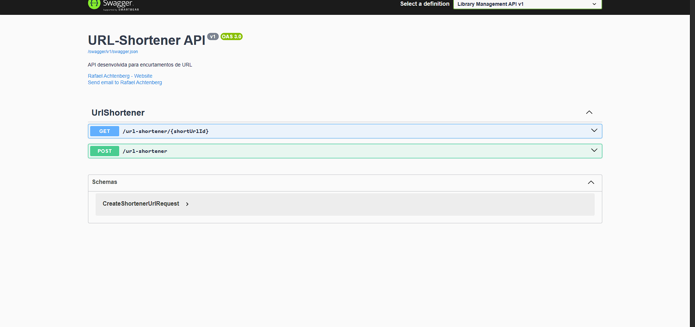
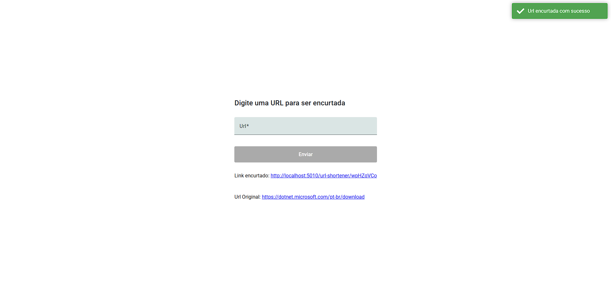
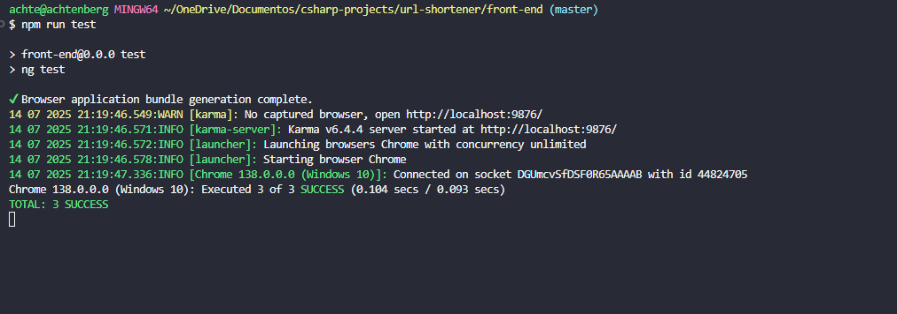

## Url-Shortener

Aplicação para encurtamento de URLs, com backend em ASP.NET Core (.NET 9) e frontend integrados no mesmo projeto. Suporta criação e consulta de URLs curtas, persistência via SQL Server e banco em memória para testes.

## Arquitetura

O projeto adota a Clean Architecture, promovendo uma separação clara entre as camadas de domínio, aplicação e infraestrutura.

Para garantir facilidade de deploy e ambiente padronizado, o projeto está containerizado utilizando Docker.

## 🗂️ Padrões e Conceitos Utilizados:

- Camada de Domínio
  Contém as entidades do negócio e as regras de negócio puras, independentes de qualquer tecnologia ou framework. É o coração da aplicação e não deve ter dependência para fora.

- Camada de Aplicação
  Responsável pela orquestração dos casos de uso, coordenando as operações entre as entidades do domínio, repositórios e serviços externos. Aqui ficam os serviços de aplicação que implementam as regras específicas de negócio.

- Camada de Infraestrutura
  Inclui tudo relacionado à implementação técnica, como persistência de dados (repositórios concretos, Entity Framework, acesso a bancos), integração com APIs externas, envio de emails, arquivos, e outros detalhes de implementação.

- Camada de Apresentação / Interface
  Exposta via APIs REST, UI, ou qualquer interface que o usuário final utilize. Esta camada consome os serviços da aplicação e transforma dados para formatos amigáveis, geralmente utilizando DTOs para comunicação.

- DTO (Data Transfer Object)
  Utilizado para transportar dados entre as camadas da aplicação, especialmente entre a API e os serviços. Garante que apenas os dados necessários sejam expostos ou recebidos, aumentando a segurança e a eficiência da aplicação.

- Dependency Injection (Injeção de Dependências)
  Aplicada de forma extensiva para reduzir o acoplamento entre os componentes, facilitar testes e permitir maior flexibilidade na troca de implementações.

## 🛠️ Tecnologias Utilizadas

### Back-end

- [.NET](https://dotnet.microsoft.com/pt-br/)
- [ASP.NET](https://learn.microsoft.com/pt-br/aspnet/core/?view=aspnetcore-9.0&WT.mc_id=dotnet-35129-website)
- [Entity-Framework-Core](https://learn.microsoft.com/en-us/ef/core/)
- [SqlServer](https://www.microsoft.com/pt-br/sql-server/sql-server-downloads)
- [XUnit](https://learn.microsoft.com/pt-br/dotnet/core/testing/unit-testing-csharp-with-xunit)
- [InMemory](https://learn.microsoft.com/pt-br/ef/core/providers/in-memory/?tabs=dotnet-core-cli)
- [Moq](https://learn.microsoft.com/pt-br/shows/visual-studio-toolbox/unit-testing-moq-framework)

## Front-end

- [Angular 19](https://angular.io/)
- [Angular Signals](https://angular.dev/features/reactivity)
- [RxJS](https://rxjs.dev/)
- [TypeScript](https://www.typescriptlang.org/)
- [Scss](https://sass-lang.com/)
- [Angular Forms (Reactive Forms)](https://angular.io/guide/reactive-forms)

🔧 **DevOps e Deploy**

- [Git](https://git-scm.com)
- [Docker](https://www.docker.com/)

🧪 **Como Rodar os Testes**

O projeto possui testes automatizados para garantir a qualidade do código e o funcionamento correto das funcionalidades implementadas. Veja abaixo como executar esses testes:

Testes Backend (.NET)
Para rodar os testes unitários do backend:

Abra o terminal na pasta raiz do projeto backend.

Execute o comando:

    $ dotnet test

🖥️ **Testes Frontend (Angular)**

Para rodar os testes unitários do frontend Angular:

Abra o terminal na pasta raiz do projeto frontend.

Execute o comando:

    $ npm run test

## Documentação

Api Documentada via OpenApi.

## 📸 Prévia da aplicação

Abaixo algumas prévias principais da aplicação:

### Interface

🚀 **Como Rodar o Projeto**

Para rodar o projeto em seu ambiente local, siga os passos abaixo:

1.  Clonar o Repositório
    Primeiramente, clone o repositório do GitHub para sua máquina local:

        $ git clone https://github.com/Faelkk/url-shortener

2.  Instalar as Dependências
    Acesse o diretório do projeto e instale as dependências:

        $ dotnet restore

3.  Configurar o Docker Compose
    Antes de rodar o projeto, configure as variáveis do docker-compose de acordo com as suas necessidades. Certifique-se de que o Docker e o Docker Compose estão instalados corretamente em sua máquina.

4.  Construir o Projeto com Docker
    Crie as imagens do Docker para o projeto:

        $ docker compose build

5.  Subir o Projeto
    Finalmente, suba o projeto utilizando Docker Compose:

        $ docker compose up -d

 

🤝 **Como Contribuir?**

- ⭐ Deixe uma estrela no repositório.
- 🔗 Me siga aqui no GitHub.
- 👥 Conecte-se comigo no LinkedIn e faça parte da minha rede profissional.

👨‍💻**Autor**
Desenvolvido por [Rafael Achtenberg](linkedin.com/in/rafael-achtenberg-7a4b12284/).
